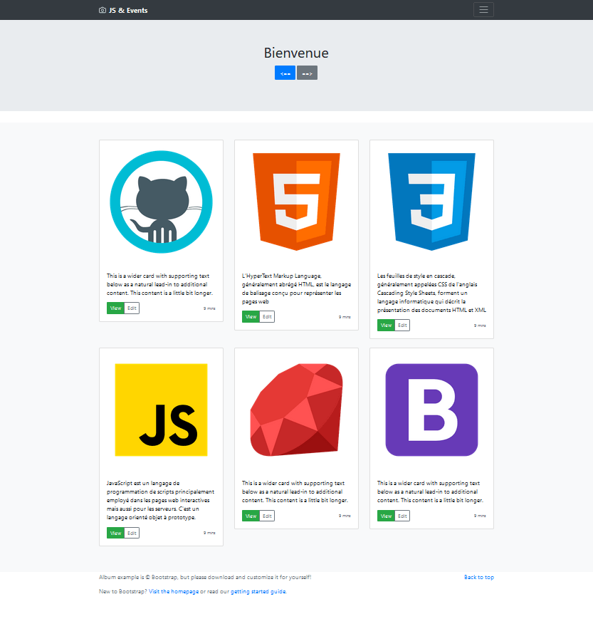

# Exercices de base en JavaScript

## 1. À propos

Pour ce **jour 41** de la formation développeur web, nous allons créer notre première page interactive à base de JavaScript. Nous partons de cette [page HTML](https://github.com/TheHackingProject/JS_events) déjà faite puis nous allons modifier le `script.js` pour la dynamiser suivant ces consignes :

1. Compter en console le nombre de fois que l'utilisateur clique sur le footer
1. Faire fonctionner le "Hamburger Menu" de la navbar
1. Passer la couleur du texte de la première carte en rouge quand on clique sur "Edit"
1. Passer la couleur du texte de la deuxième carte en alternance vert/noir quand on appui sur le bouton "Edit"
1. Désactiver le CDN Bootstrap quand on double clique sur la navbar
1. Miniaturiser/agrandir les cartes quand on survol leur bouton "View"
1. Faire tourner les 6 cartes dans le sens des aiguilles d'une montre lors de l'appui sur le bouton "==>"
1. Faire tourner les 6 cartes dans le sens inverse des aiguilles d'une montre lors de l'appui sur le bouton "<=="
1. Réorganiser le body de différentes manières si l'on combine clique sur le logo + une touche (a, y, p ou b)

## 2. Lancement des scripts

Ouvrir `exo_events.thml` sur un navigateur. Certains résultats s'affichent en console.:eyes: (F12 pour y accéder)

## 3. Aperçu

